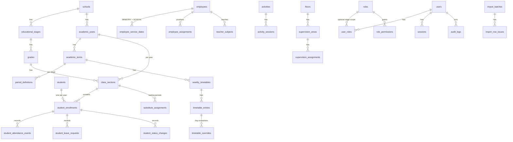

# مخطط العلاقات (مختصر)

```mermaid
erDiagram
  schools ||--o{ educational_stages : has
  schools ||--o{ academic_years : has
  academic_years ||--o{ academic_terms : has
  educational_stages ||--o{ grades : has
  grades ||--o{ class_sections : has
  academic_years ||--o{ class_sections : "per year"
  students ||--o{ student_enrollments : "one per year"
  class_sections ||--o{ student_enrollments : contains
  student_enrollments ||--o{ student_attendance_events : records
  student_enrollments ||--o{ student_leave_requests : records
  student_enrollments ||--o{ student_status_changes : records
  employees ||--o{ employee_service_dates : "MINISTRY + SCHOOL"
  employees ||--o{ employee_assignments : positions
  employees ||--o{ teacher_subjects : teaches
  academic_terms ||--o{ period_definitions : "per stage"
  academic_terms ||--o{ weekly_timetables : has
  weekly_timetables ||--o{ timetable_entries : has
  timetable_entries ||--o{ timetable_overrides : "day exceptions"
  class_sections ||--o{ substitute_assignments : "waiting periods"
  activities ||--o{ activity_sessions : has
  floors ||--o{ supervision_areas : has
  supervision_areas ||--o{ supervision_assignments : has
  users ||--o{ user_roles : has
  roles ||--o{ user_roles : "optional stage scope"
  roles ||--o{ role_permissions : grants
  users ||--o{ sessions : has
  users ||--o{ audit_logs : acts
  import_batches ||--o{ import_row_issues : has
```
